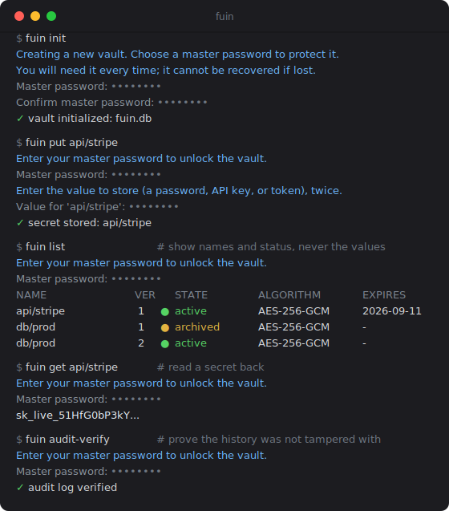

# Fuin: Local Secrets Manager with Envelope Encryption and Tamper-Evident Audit Log

[](https://github.com/yuchien1022/fuin/actions/workflows/ci.yml)
[](LICENSE)



A local, zero-server secrets manager for developer secrets (API keys,
database passwords, tokens, `.env` contents). It uses envelope encryption
and a tamper-evident, externally verifiable audit log, and runs as a
single CLI binary: `fuin <command> <args>`.

Fuin (封印, "seal") targets the gap between "too small for HashiCorp
Vault, too sensitive for a plaintext file": a scriptable CLI vault
with verifiable history and no server infrastructure. It is not a
browser or phone password manager; for website logins and autofill, use
a platform store (iCloud Keychain, Android Keystore, Windows Hello).

## Quick start

Fuin is a single C binary. Build from the directory containing `Makefile`.

From GitHub:

```bash
git clone https://github.com/yuchien1022/fuin.git
cd fuin
```

If you already have the source tree, `cd` to the repository root instead.

Install dependencies:

**macOS (Homebrew)**

```bash
brew install libsodium sqlite3 openssl@3 pkgconf
```

**Debian / Ubuntu**

```bash
sudo apt install build-essential pkg-config libsodium-dev libsqlite3-dev libssl-dev
```

Build and install:

```bash
make
make install PREFIX="$HOME/.local"
export PATH="$HOME/.local/bin:$PATH"
```

Basic usage:

```bash
fuin init                                # create ./fuin.db; set master password (asked twice)
printf 'my-secret' | fuin put db/prod --stdin
fuin get db/prod                         # prints the secret
fuin list                                # shows names and metadata only
fuin audit-verify                        # verifies the audit log
```

If you skip `make install`, run `./fuin` from the repository root.

The master password comes from the no-echo prompt or `FUIN_PASSWORD`.
Direct sensitive argv values (`-p`, `--new-password`, `--token`, and
`-v`/`--value`) are disabled by default because they are visible in
process lists and shell history; set `FUIN_ALLOW_INSECURE_ARGS=1` only
for legacy or test automation.

Add `--db PATH` to choose where the vault lives (default: `./fuin.db`).

## Installation details

Dependency version notes:

- `make check-deps` warns if libcrypto is below the recommended 3.6.3
  but still builds; set `OPENSSL_MIN_VERSION` to change the threshold.
- libsodium >= 1.0.19 enables the AEGIS-256 cipher option.
- ML-DSA-65 audit-root signing and ML-KEM-768 hybrid backups require
  OpenSSL >= 3.5, satisfied by current 3.6.x.

`make install` honors `PREFIX` (default `/usr/local`) and `DESTDIR`.
The user-local install shown above writes to `$HOME/.local/bin/fuin`
without `sudo`. System-wide install:

```bash
sudo make install      # installs /usr/local/bin/fuin
sudo make uninstall    # removes /usr/local/bin/fuin
```

## Terminal output

Output is colourised on interactive terminals: states are colour-coded
(green active, yellow archived, red expired), headings and counts are
highlighted. Piped or redirected output is plain text with no escape
codes; set `NO_COLOR=1` (or `TERM=dumb`) to disable colour everywhere.

## Demos

```bash
make demo          # interactive tour: KDF, envelope encryption, audit chain
make demo-tamper   # live audit-log tamper detection
```

Setup details (PyNaCl/libsodium for the KDF visualization, custom database
path) and a step-by-step walkthrough are in
[docs/DEVELOPMENT.md](docs/DEVELOPMENT.md#demos).

## Using the vault

Worked examples of common workflows. Run `fuin --help` for all commands
and flags.

| Task | Command |
|---|---|
| Store / read a secret | `fuin put NAME --stdin` / `fuin get NAME` |
| List names + metadata | `fuin list` |
| Generate a password | `fuin generate NAME` |
| 2FA (TOTP) code | `fuin totp NAME` |
| Read old version / roll back | `fuin get NAME --version N` / `fuin rollback NAME --version N` |
| Change master password | `fuin rotate-kek` |
| Verify the audit log | `fuin audit-verify` |
| Vault status summary | `fuin status-report` |

Secret values go to stdout; confirmations, prompts, and errors go to
stderr. Command substitution and redirection capture only the value.

### Store and retrieve secrets

```bash
fuin put db/prod --stdin < password.txt   # from a file or pipe
printf '%s' 'sk_live_...' | fuin put api/stripe --stdin
fuin get db/prod                          # print to stdout
fuin get db/prod --raw > password.bin      # exact bytes, no trailing newline
fuin get db/prod --copy                   # clipboard; auto-clears in 30 s
fuin list                                 # names and metadata, never values
fuin delete api/stripe                    # soft-delete; history is kept
```

Names are free-form; `/` makes a natural hierarchy (`db/prod`,
`ci/deploy-token`). Plain `get` appends a trailing newline; use
`get --raw` for binary secrets or exact-byte comparison. Every operation
is appended to the audit log.

### Generate strong passwords

```bash
fuin generate db/prod                 # prints only the new password to stdout
fuin generate wifi/home --length 32 --no-symbols --copy
```

### Two-factor codes (TOTP)

Store the base32 seed, then request codes. Each generation logs a READ
audit entry:

```bash
printf '%s' 'JBSWY3DPEHPK3PXP' | fuin put otp/github --stdin
fuin totp otp/github          # 6-digit RFC 6238 code (also --copy)
```

### Versions, rollback, expiry

Updates never overwrite: each `put` to an existing name creates a new
version and archives the old one.

```bash
printf '%s' 'new-password' | fuin put db/prod --stdin      # now version 2
fuin get db/prod --version 1          # read an old version
fuin rollback db/prod --version 1     # restore v1 as a NEW active version
printf '%s' 'abc' | fuin put session/key --stdin --ttl 90d # expires in 90 days
fuin check-expiry --within 7d         # what needs attention this week
fuin auto-rotate                      # re-key all expired secrets
```

### Verify your history

```bash
fuin audit-verify             # recheck the whole hash chain + signatures
fuin audit-root               # 32-byte Merkle root: save it OUTSIDE the vault
fuin audit-proof --entry-id 5 # inclusion proof for one event
fuin audit-verify-proof --entry-id 5 --root ... --proof ... --leaf-index ... --entries ...
```

Anyone holding a previous root can detect any later rewrite or
truncation. With a supported OpenSSL baseline you can also sign the root
post-quantum: `audit-keygen`, `audit-sign-root --private-key ...`, and
verify offline with `audit-verify-root-sig` (no vault or password
needed). Run `make demo-tamper` to see tamper detection live.

### Change the master password

```bash
fuin rotate-kek    # prompts for old + new; atomic, crash-safe
```

For non-interactive automation, set `FUIN_PASSWORD` for the current
password and `FUIN_NEW_PASSWORD` for the replacement. Only the 32-byte
wrapped DEKs are re-encrypted, so rotation is fast regardless of secret
sizes. The crypto-only cost is roughly 1--2 us per secret; the full
5000-row end-to-end `rotate-kek` path completes in about 140 ms.

### Post-quantum backups

```bash
fuin pqc-keygen --public-out backup.pub --private-out backup.key
fuin backup-export --recipient backup.pub --out backup-2026-06.fuincap
fuin backup-import --private-key backup.key --input backup-2026-06.fuincap --out restored.db
```

The capsule is sealed with X25519+ML-KEM-768 and bound to the verified
audit state; restoring still requires the master password.

## Security design

| Layer | Mechanism |
|---|---|
| **Encryption** | Envelope: per-secret 256-bit DEK wrapped by Argon2id KEK (ops=3, mem=64 MB). Password rotation rewraps DEKs only — up to 520x faster than naive re-encryption. |
| **AEAD** | AES-256-GCM, XChaCha20-Poly1305, AEGIS-256. AAD binds `H(row_id, name):version` into every ciphertext, preventing cross-row swaps. |
| **Key commitment** | 64-byte keyed-BLAKE2b commitment per secret (CMT-1). Closes multi-key and partition-oracle attacks. |
| **Audit log** | SHA-256 hash chain + forward-secure HMAC ratchet. Merkle root for external anchoring; O(log n) inclusion proofs. Optional ML-DSA-65 post-quantum root signing. |
| **Rotation** | DEK rewrap, verifier, commitments, and audit re-sign commit in one SQLite WAL transaction; crash rolls back cleanly. |
| **PQ backup** | ML-KEM-768 + X25519 hybrid KEM capsule, audit root bound into KDF. |
| **Hygiene** | `sodium_malloc`/`mlock`/`memzero` on all key material, constant-time comparisons, parameterized SQL, owner-only files, symlink rejection, `O_EXCL` outputs. |

## Verification status

| Check | Result |
|---|---|
| `-Wall -Wextra -Werror` | Zero warnings on macOS clang and Linux gcc |
| 10 unit suites, 120+ test cases | AddressSanitizer, Valgrind: zero errors |
| libFuzzer (audit, CLI, vault parsers) | 60 s each, zero outstanding crashes |
| gcov (core modules) | 85--91 % line coverage |
| NIST SP 800-38D AES-256-GCM | Known-answer test (Test Case 16) passed |

## Honest limitations

Research-grade software, **not independently audited**. Known boundaries:

| Boundary | Detail |
|---|---|
| **Password = root of trust** | Same model as pass / KeePass / age. No second factor; `rotate-kek` re-protects future access only. |
| **No hardware key store** | Keys live in locked RAM, not Secure Enclave / TPM. |
| **Metadata visible** | Display names encrypted, lookup names are keyed hashes. Timestamps, version counts, algorithm choice, and archive/expiry state are in the clear. |
| **Failed logins outside audit chain** | Tracked in an unauthenticated table; the audit key derives from the correct password. Brute-force resistance relies on Argon2id. |
| **Merkle root** | Inclusion proofs have evidentiary value only if the root is stored outside the vault. |
| **Clipboard** | `--copy` exposes the secret to the OS clipboard for up to 30 s. |
| **Soft-delete only** | Deleted secrets are archived, not cryptographically erased. |
| **No auto-migration** | Schema changes (key-commitment, AAD, encrypted names) require a vault rebuild. |

## More documentation

Contributor and verification notes (interactive demos, audit-ratchet
internals, Valgrind/Docker workflow) are in
[docs/DEVELOPMENT.md](docs/DEVELOPMENT.md).

## Acknowledgments

Built in collaboration with [Claude Code](https://claude.ai/code) and [Codex](https://chatgpt.com/codex) (OpenAI).

## License

MIT. See [LICENSE](LICENSE). Vulnerability reports: see
[SECURITY.md](SECURITY.md).
